```mermaid
timeline
    title 👑 Princess Gimashi's Cyber Journey
    2023 : Started Royal Academy of Cybersecurity 🎓
         : First Dragon (Vulnerability) Slain 🐉
         : Joined the Order of Ethical Hackers ⚔️
    2024 : Became Guardian of 50+ Digital Castles 🏰
         : Mastered the Art of Penetration Testing 🎯
         : Earned Title "Threat Hunter Extraordinaire" 🌙
         : Founded Royal Security Academy 📚
    2025 : Currently expanding cloud kingdom defenses ☁️
         : Working on AI security enchantments 🤖
         : Planning world domination... I mean, protection! 🌍
```

<!-- Royal Cyber Crown Header -->
<div align="center">
  
</div>

<!-- Magical Typing Animation -->
<div align="center">
  
</div>

<!-- Royal Stats with Sparkles -->
<div align="center">
  
  
  
</div>

<br/>

<!-- Royal Decree Section -->
<div align="center">
  
```
╔══════════════════════════════════════════════════════════════════════════╗
║                          🏰 ROYAL DECREE 🏰                              ║
║                                                                          ║
║  "I hereby declare my reign over the digital realm, where every line    ║
║   of code is a spell, every vulnerability is a dragon to slay, and      ║
║   every system secured is a kingdom saved." 👑                          ║
║                                                                          ║
║                        - Princess Gimashi, First of Her Name            ║
║                          Protector of Firewalls 🛡️                      ║
╚══════════════════════════════════════════════════════════════════════════╝
```

</div>

<!-- Two Column Princess Profile -->
<table align="center" style="border: none;">
  <tr>
    <td width="60%" align="center">
      
## 🌟 The Princess Chronicles

<div align="left">
  
### 👸 Royal Biography
Once upon a time, in the mystical island of **Sri Lanka** 🇱🇰, there lived a princess who discovered her true calling wasn't in traditional castles, but in **digital fortresses**. Armed with her trusty laptop ⚔️ and an endless supply of coffee ☕, Princess Gimashi protects the cyber realm from malicious dragons (aka hackers) while wearing her invisible crown of code.

### 🔮 Magical Powers
- **🛡️ Shield Conjuring** - Creating impenetrable security barriers
- **🔍 Truth Sight** - Seeing through deceptive vulnerabilities  
- **⚡ Lightning Code** - Writing scripts faster than royal scribes
- **🌙 Night Vision** - Late-night threat hunting abilities
- **💎 Gem Detection** - Finding hidden security flaws in code

### 🏰 Current Royal Duties
```yaml
title: "Cybersecurity Princess"
domain: "Digital Kingdom Protection"
specialties:
  - network_enchantments: "Securing royal networks"
  - penetration_quests: "Ethical hacking adventures" 
  - incident_magic: "Rapid threat response spells"
  - cloud_castles: "Fortifying cloud kingdoms"
status: "Always accepting new quests!"
```

</div>
      
    </td>
    <td width="40%" align="center">
      


### 🎀 Princess Stats
```
┌─────────────────────────────┐
│  👑 Level: 99 Cyber Princess │
│  ⚔️  Threats Defeated: 500+  │
│  🏰 Systems Protected: 100+  │
│  📚 Knowledge Scrolls: ∞     │
│  ☕ Coffee Potions: 999+     │
│  🌙 All-nighters: Too many  │
│  💎 Bugs Squashed: 1000+    │
│  🔮 Magic Spells: Learning   │
└─────────────────────────────┘
```

### 🌸 Royal Mood Board
Currently vibing to: **Synthwave Princess Mix** 🎵 
Favorite debugging snack: **Pink macaron cookies** 🍪 
Royal pet: **Rubber duck named Duchess** 🦆  
Secret weakness: **Cute cat videos** 😸

    </td>
  </tr>
</table>

<!-- Magical Arsenal Section -->
<div align="center">
  <h2>🔮 Royal Cybersecurity Arsenal</h2>
  <p><em>✨ These enchanted tools help protect the digital kingdom! ✨</em></p>
</div>

<div align="center">
  
<!-- First Row of Arsenal -->
<table>
  <tr>
    <th>🗡️ Attack Spells</th>
    <th>🛡️ Defense Magic</th>
    <th>🔍 Detective Potions</th>
    <th>☁️ Sky Castle Tools</th>
  </tr>
  <tr>
    <td align="center">
      <br/>
      <br/>
      
    </td>
    <td align="center">
      <br/>
      <br/>
      
    </td>
    <td align="center">
      <br/>
      <br/>
      
    </td>
    <td align="center">
      <br/>
      <br/>
      
    </td>
  </tr>
</table>

</div>

<!-- Princess Programming Languages -->
<div align="center">
  <h3>💖 Royal Programming Languages</h3>
  <p>
    
  </p>
  <p><em>Fluent in the ancient tongues of code! ✨</em></p>
</div>

<!-- Royal Achievements Timeline -->
<div align="center">
  <h2>🏆 Royal Achievements & Conquests</h2>
</div>

<div align="center">



</div>

<!-- Princess Skills Showcase -->
<div align="center">
  <h2>💎 Royal Skill Gems</h2>
</div>

<div align="center">
  


</div>

<!-- Royal Github Stats -->
<div align="center">
  <h2>📊 Royal GitHub Statistics</h2>
</div>

<div align="center">
  


</div>

<!-- Royal Court (Connect) -->
<div align="center">
  <h2>👸 Join My Royal Court</h2>
  <p><em>Connect with the Cyber Princess across the digital kingdoms! 💖</em></p>
  
  <a href="https://linkedin.com/in/your-profile">
    
  </a>
  <a href="https://twitter.com/your-handle">
    
  </a>
  <a href="mailto:your.email@example.com">
    
  </a>
  <a href="https://medium.com/@your-handle">
    
  </a>
  
</div>

<!-- Activity Graph -->
<div align="center">
  <h3>🌟 Royal Activity Constellation</h3>
  
</div>

<!-- Royal Footer -->
<div align="center">
  
  <h2>✨ Royal Farewell Message ✨</h2>
  
```
╔══════════════════════════════════════════════════════════════╗
║                                                              ║
║  "Remember, every great kingdom was built one secure line    ║
║   of code at a time. Stay curious, stay caffeinated, and    ║
║   keep your firewalls fabulous!" 💖                         ║
║                                                              ║
║                    - Princess Gimashi 👑                     ║
╚══════════════════════════════════════════════════════════════╝
```

  <p>
    <em>Made with lots of 💖, endless ☕, and a sprinkle of ✨ magic</em><br/>
    <em>By Princess Gimashi Gimhara 👑</em><br/>
    <small>🇱🇰 Ruling the digital realm from the pearl of the Indian Ocean</small>
  </p>
  
  
  
</div>
